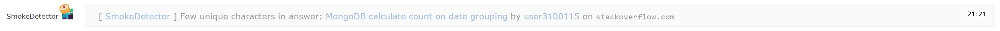

SmokePreview
============

A [GreaseMonkey](https://addons.mozilla.org/firefox/addon/greasemonkey/) script
to add a preview to chat messages of the [SmokeDetector](https://github.com/Charcoal-SE/SmokeDetector).

Messages which are deleted while loading the preview will get a opacity of 50%
to make clear that this is not relevant.

##How can I get it?

1. Install [GreaseMonkey](https://addons.mozilla.org/firefox/addon/greasemonkey/) (for Firefox) or 
   [TamperMonkey](https://chrome.google.com/webstore/detail/tampermonkey/dhdgffkkebhmkfjojejmpbldmpobfkfo)
   (for Chrome)
2. Install the user script by clicking [here](https://github.com/rekire/SmokePreview/raw/master/SmokePreview.user.js)
   or install the [development version](https://github.com/rekire/SmokePreview/raw/develop/SmokePreview.user.js)
   which will been updated more often (theoretically).

##Planned features
- Hide message if you are not registered on that site.
- Hide preview when a user send a gone message.
- Make ignored sites configurable.

##How does it look?

##License
This code is licensed under the [Rekisoft Public License](http://www.rekisoft.eu/licenses/rkspl.html).