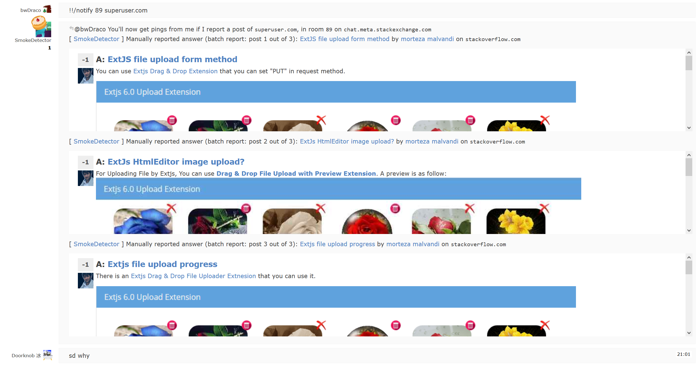

SmokePreview
============

A [Greasemonkey](https://addons.mozilla.org/firefox/addon/greasemonkey/) script
to add a preview to chat messages of the [SmokeDetector](https://github.com/Charcoal-SE/SmokeDetector).

Messages which are deleted while loading the preview will get a opacity of 50%
to make clear that this is not relevant.

This code is licensed under the [Rekisoft Public License](http://www.rekisoft.eu/licenses/rkspl.html).

#Planned features
- Add option to mark a message as spam from the chat.
- Hide preview when a user send a gone message.

#How does it look?
